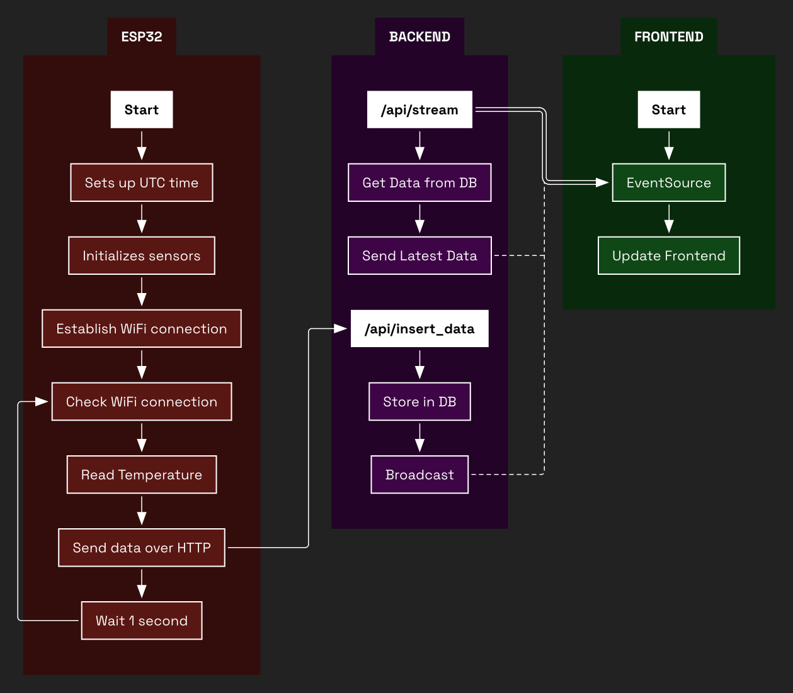
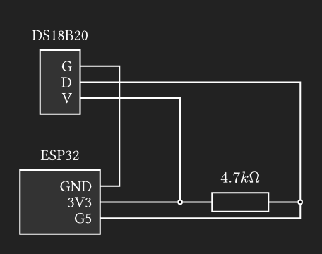

# Simple Temperature Reader

> This is an educational IoT project that demonstrates how to collect sensor data with an ESP32, push it into a server, store it in a database, and visualize it in real time in a web client.

# Project Overview

This project connects a DS18B20 temperature sensor to an ESP32 controller, sends the readings to a backend, and visualizes the data in a realtime web application.

We can differentiate 3 different modules:

- **The ESP32**: The main module. Reads the temperature data and transmits it to the backend server over WiFi using HTTP POST requests. The backend processes and stores the data.
- **The backend**: This module manages the data. It uses an SQLite database to persist all sensor readings for historical reference and analysis. The data is then streamed over to the frontend via Server-Sent Events (SSE), enabling live updates without page reloads.
- **The frontend**: This module shows the data. It collects the data streamed by the backend and displays the readings in real time, allowing users to monitor live sensor data.

The following diagram illustrates the interaction between the ESP32, backend, and frontend modules:



# Hardware Requirements and Wiring

This project requires some hardware and wiring for it to work properly. The list of components are:
- An ESP32 controller. The one used for this project is an ESP32-WROOM-32 development board (any common dev board will work)
- A DS18B20 digital temperature sensor.
- A 4.7kOhm resistor.

The following diagram shows how the wiring must be done for the project:



# Software Setup Instructions

There are two main software projects: an arduino project (`embedded/`) and a sveltekit project (`server/`).

## Arduino Project

To use the arduino project, open the sketch in `embedded/embedded.ino` with Arduino IDE v2. You must install the `DallasTemperature` and `OneWire` libraries. Also, create a `WiFiCredentials.h` file and define three constants with your own values: `WIFI_SSID`, `WIFI_PASSWORD` and `API_ENDPOINT`.

## SvelteKit Project

To use the sveltekit project, use `npm` or similar to install the dependencies (`npm i`) and then run the server using `npm run dev --host`. You will also need to open up the port `5173` (or `4173` if deployed).

# API Documentation

The server has two endpoints:

- `/api/insert_data`: Receives a POST request containing a single temperature data point with the following json structure:
    ```json
    {
        "timestamp": 1758712352,
        "data": 25
    }
    ```

    When a data insertion was successful, the server returns a typical `200 OK`.

- `/api/stream`: Handles a GET request, returning a ReadableStream object for the frontend using Server-Sent Events (SSE). This stream sends data each time a data point is inserted through the `/api/insert_data` endpoint.

    A typical client would use this endpoint in the following way:

    ```js
    const source = new EventSource("/api/stream");
    source.onmessage = (event) => {
      const data = JSON.parse(event.data);
      console.log(data); // { timestamp: 1695555555, data: 27.75 }
    };
    ````

# Known Limitations and Future Improvements

- **In-memory event streaming:** SSE connections are ephemeral. A message broker (Redis, MQTT) would improve scalability.
- **No authentication:** Currently, any client on the network can send or consume data. Adding an API key or token-based auth would secure the system.
- **Timestamps rely on NTP:** Without internet access, the ESP32 falls back to `0` timestamps. Consider local RTC as backup.
- **Database persistence:** SQLite is simple and lightweight, but not ideal for larger deployments. PostgreSQL or MySQL would be more robust.
- **Frontend visualization:** Current frontend displays data, but richer charts/graphs (e.g., with Recharts or D3.js) could improve usability.
- **Alerts & thresholds:** Add support for notifications (e.g., when temperature exceeds safe limits).

# License

This project is licensed under the MIT License.
You are free to use, modify, and distribute this software, provided that the original copyright notice and this license text are included in all copies or substantial portions of the software.

See the [LICENSE](./LICENSE) file for the full text.
