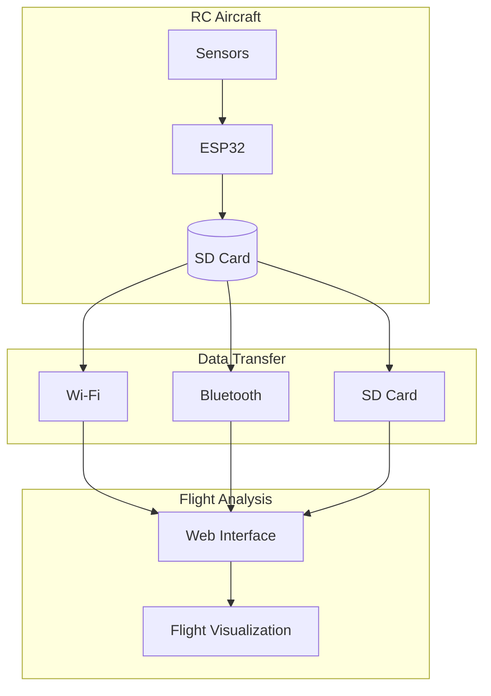

# RC Black Box

> An educational embedded systems project for recording and analyzing RC aircraft flights.

## Project Overview

The RC Black Box is a small onboard data recorder designed to be installed inside an RC aircraft.

The system collects data from a variety of sensors during flight, processes and combines the collected data, and stores it locally for later analysis. After the flight, the recorded data can be transferred to a computer or phone and visualized through a web interface.

The project is intended as a practical exploration of embedded systems, sensor integration, data processing, storage, and communication.

At a high level, the system follows this pipeline:

```mermaid
flowchart TB
    subgraph Aircraft["RC Aircraft"]
        S[Sensors]
        ESP[ESP32]
        SD[(SD Card)]

        S --> ESP
        ESP --> SD
    end

    subgraph Transfer["Data Transfer"]
        WIFI[Wi-Fi]
        BT[Bluetooth]
        SDT[SD Card]
    end

    subgraph Analysis["Flight Analysis"]
        WEB[Web Interface]
        VIZ[Flight Visualization]
    end

    SD --> WIFI
    SD --> BT
    SD --> SDT

    WIFI --> WEB
    BT --> WEB
    SDT --> WEB

    WEB --> VIZ

```

## Main Goals

- Collect data from multiple sensors during an RC aircraft flight.
- Process and combine sensor data on the embedded device.
- Store flight data locally on an SD card.
- Transfer recorded data for later analysis.
- Visualize flight data through a web interface.
- Explore embedded systems through a complete, practical project.

## Hardware

The exact hardware configuration is still evolving as the project develops.

Current and potential components include:

- ESP32 development board
- BME/BMP280
- BMP388
- 9-axis gyroscope / IMU
- INA219 DC current monitor
- GY-NEO6MV2 GPS module
- MicroSD card storage

Additional sensors and components may be added as the project evolves.

## Software

The project combines embedded software with a web-based interface.

The embedded system is responsible for sensor acquisition, data processing, storage, and communication.

The web application is responsible for importing and visualizing recorded flight data.

The exact software architecture and technologies may change as the project develops.

## Documentation

The README provides a general overview of the project. More detailed information about the development process, experiments, hardware, and lessons learned will be documented separately.

- `docs/`: Project documentation and technical notes.
- `docs/experiments/`: Experiments and investigations carried out during development.
- `docs/hardware/`: Hardware, sensors, wiring, and component-specific information.
- `docs/software/`: Software architecture and implementation notes.

## Project Status

This project is currently under development.

Hardware, software architecture, and sensor selection are expected to change as development and experimentation continue.

## AI Disclaimer

No AI was used in the development of this project.

## License

This project is licensed under the MIT License.

You are free to use, modify, and distribute the software, provided that the original copyright notice and license are included in all copies or substantial portions of the software.

See the LICENSE file for the full text.
